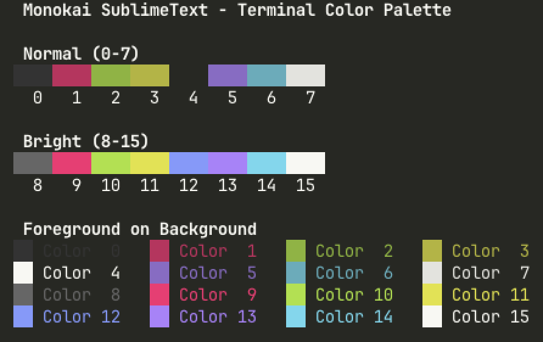

<div align="center">

# Monokai SublimeText

[](LICENSE)
[](https://github.com/howar31/monokai-sublimetext/commits)
[](https://github.com/howar31/monokai-sublimetext)
[](https://www.lua.org)
[](https://conventionalcommits.org)
[](https://ko-fi.com/howar31)

</div>

A faithful Monokai color scheme with proper ANSI terminal color mapping for modern terminal emulators and editors.

## Why?

The original [Monokai](https://monokai.pro/) by Wimer Hazenberg (2006) was designed for code editors (TextMate, Sublime Text), not terminals. It defines 6 signature syntax colors but no ANSI terminal palette. Different terminal emulators map these colors differently — some put **orange where blue should be** (e.g., Ghostty's built-in "Monokai Classic" maps ANSI index 4 to `#FD971F`).

This theme uses the proven ANSI mapping from VS Code/Cursor's Monokai, which properly separates normal (muted) and bright (vivid) color variants and places correct blue tones at index 4 and 12.

Named "SublimeText" as a tribute to where many of us first fell in love with Monokai.

## Screenshot



## Color Palette

### ANSI Terminal Colors

| Index | Role           | Normal (muted) | Bright (vivid) |
|-------|----------------|----------------|----------------|
| 0/8   | Black/Grey     | `#333333`      | `#666666`      |
| 1/9   | Red/Pink       | `#C4265E`      | `#f92672`      |
| 2/10  | Green          | `#86B42B`      | `#A6E22E`      |
| 3/11  | Yellow         | `#B3B42B`      | `#e2e22e`      |
| 4/12  | Blue           | `#6A7EC8`      | `#819aff`      |
| 5/13  | Magenta/Purple | `#8C6BC8`      | `#AE81FF`      |
| 6/14  | Cyan           | `#56ADBC`      | `#66D9EF`      |
| 7/15  | White          | `#e3e3dd`      | `#f8f8f2`      |

### Monokai Syntax Colors

| Role       | Color     | Hex       |
|------------|-----------|-----------|
| Background |           | `#272822` |
| Foreground |           | `#f8f8f2` |
| Comment    | Grey      | `#75715E` |
| String     | Yellow    | `#E6DB74` |
| Keyword    | Pink      | `#F92672` |
| Function   | Green     | `#A6E22E` |
| Number     | Purple    | `#AE81FF` |
| Type       | Cyan      | `#66D9EF` |
| Parameter  | Orange    | `#FD971F` |

## Supported Applications

### Ghostty

Symlink the theme file to your Ghostty themes directory:

```bash
mkdir -p ~/.config/ghostty/themes
ln -s "$(pwd)/ghostty/Monokai SublimeText" ~/.config/ghostty/themes/
```

Then set in your Ghostty config (`~/.config/ghostty/config`):

```
theme = Monokai SublimeText
```

### Neovim

#### Using [lazy.nvim](https://github.com/folke/lazy.nvim)

```lua
{
  dir = "/path/to/monokai-sublimetext/nvim",
  priority = 1000,
  config = function()
    vim.cmd.colorscheme("monokai-sublimetext")
  end,
}
```

#### Manual

Add the `nvim/` directory to your runtimepath in `~/.config/nvim/init.lua`:

```lua
vim.opt.rtp:prepend("/path/to/monokai-sublimetext/nvim")
vim.cmd.colorscheme("monokai-sublimetext")
```

### Vim

Symlink the colorscheme file to your Vim colors directory:

```bash
mkdir -p ~/.vim/colors
ln -s "$(pwd)/vim/colors/monokai-sublimetext.vim" ~/.vim/colors/
```

Then add to your `~/.vimrc`:

```vim
set termguicolors
colorscheme monokai-sublimetext
```

> **Note:** Requires Vim 8+ with `termguicolors` support for accurate colors.

## Color Sources

- **ANSI palette**: [VS Code built-in Monokai theme](https://github.com/microsoft/vscode/tree/main/extensions/theme-monokai)
- **Syntax colors**: [Original Monokai tmTheme](https://www.monokai.pro/) by Wimer Hazenberg
- **Selection/UI**: [Base16 Monokai](https://github.com/chriskempson/base16) specification

## License

[MIT](LICENSE)
